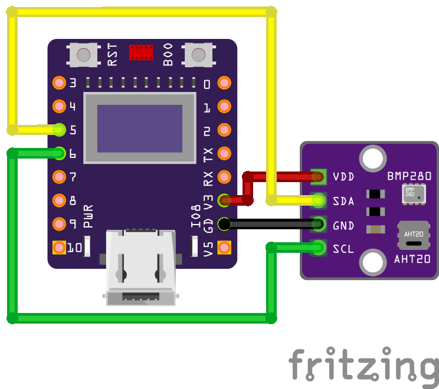

# ESP32C3 OLED Project

## Overview
This project is an IoT environmental monitoring device that displays temperature, humidity, air pressure, and dew point on a 0.42 inch OLED display with 72x40 pixel resolution. It features WiFi connectivity with automatic captive portal configuration and serves sensor data via a responsive web interface.

The device uses ESP32-C3 microcontroller with integrated 0.42 inch OLED display and AHT20 + BMP280 sensor module, developed using PlatformIO and Arduino framework.

## Features
- **ESP32 supermini** - ESP32-C3 OLED development board with integrated 0.42 inch OLED display module, WiFi, Bluetooth and ceramic antenna
- **Environmental Monitoring**: Real-time measurement of temperature, humidity, air pressure, and dew point
- **OLED Display**: Cycling display of sensor readings with IP address when connected to WiFi
- **WiFi Connectivity**: Automatic captive portal setup for easy WiFi configuration
- **Web Interface**: Responsive web server serving real-time sensor data with auto-refresh
- **WiFi Management**: 
  - Automatic config mode when no WiFi credentials are stored
  - Manual WiFi reset via BOOT button (hold for 3+ seconds)
  - Preserved settings during temporary connection failures
- **Development Environment**: PlatformIO
- **Language**: C++
- **Applications**: IoT, environmental monitoring, data visualization

## Getting Started

### Prerequisites
Ensure you have the following installed:
- [Visual Studio Code](https://code.visualstudio.com/)
- [PlatformIO IDE](https://platformio.org/install/ide)
- A compatible ESP32-C3 board with 0.42"/72x40 pixel OLED display module
- AHT20 + BMP280 sensor module

### Installation
1. Clone this repository:
   ```bash
   git clone git@github.com:jaresz/simple-the-egg.git
   ```
2. Open the project in PlatformIO IDE.
3. Connect your ESP32-C3 board to your computer.
4. Build and upload the project:
   ```bash
   pio run --target upload
   ```

### File Structure
- `platformio.ini`: Configuration file for PlatformIO.
- `src/main.cpp`: Main application code with sensor reading, WiFi management, and web server.
- `lib/`: Custom libraries.

## Technical Details

### Sensor Readings
- **Temperature**: Measured by AHT20 sensor with BMP280 backup
- **Humidity**: Measured by AHT20 sensor  
- **Air Pressure**: Measured by BMP280 sensor (converted to hPa)
- **Dew Point**: Calculated using temperature and humidity values

### WiFi Configuration
- **Access Point Name**: EggESP32
- **Default Password**: 93z45x62i
- **Configuration IP**: 192.168.4.1
- **Settings Storage**: Non-volatile memory (Preferences library)


## Hardware Details

### ESP32-C3 OLED Development Board
This project uses the ESP32-C3 OLED development board, which features:
- **Integrated OLED Display**: 0.42 inch monochromatic screen with a resolution of 72x40 pixels.
- **Connectivity**: Wi-Fi and Bluetooth capabilities.
- **Antenna**: Ceramic antenna for improved signal strength.
- **Compact Design**: Supermini form factor.

### Sensor Module: AHT20 + BMP280
The AHT20 + BMP280 module is used for measuring temperature, humidity, and air pressure. It combines:
- **AHT20**: High-accuracy temperature and humidity sensor.
- **BMP280**: Barometric pressure sensor.

### Wiring Instructions
The AHT20 + BMP280 module shares the same I2C bus as the integrated OLED screen. The connections are as follows:

| Module Pin | ESP32-C3 Pin |
|------------|--------------|
| VCC        | 3.3V         |
| GND        | GND          |
| SCL        | GPIO6        |
| SDA        | GPIO5        |

- **SCL (Clock)**: Connect to GPIO6, which is also used by the OLED display.
- **SDA (Data)**: Connect to GPIO5, which is also used by the OLED display.

The I2C bus allows multiple devices to communicate over the same data and clock lines. 

## Usage
### First Time Setup
1. Power on the ESP32-C3 board.
2. If no WiFi credentials are stored, the device automatically enters configuration mode.
3. Connect to the WiFi network "EggESP32" with password "93z45x62i".
4. Open a web browser and navigate to `http://192.168.4.1`.
5. Enter your WiFi network credentials and save.
6. The device will restart and connect to your WiFi network.

### Normal Operation
1. The OLED display cycles through:
   - Temperature (3 times with extended display time)
   - Humidity
   - Air Pressure  
   - Dew Point (with frame border)
   - IP Address (split across two lines)
2. Access the web interface by navigating to the device's IP address in your browser.
3. The web interface provides:
   - Real-time sensor readings
   - Automatic updates every 5 seconds
   - Manual refresh capability
   - Mobile-friendly responsive design

### WiFi Reset
- Hold the BOOT button for 3+ seconds to reset WiFi credentials
- The device will display "WiFi Reset" and automatically restart in configuration mode

### Configuration Mode Display
When in configuration mode, the OLED alternates between:
- WiFi network name (SSID)
- WiFi password
- Configuration IP address (192.168.4.1)
- Live sensor readings (temperature, humidity, pressure, dew point)

## License
This project is licensed under the MIT License. See the [LICENSE](LICENSE) file for details.

